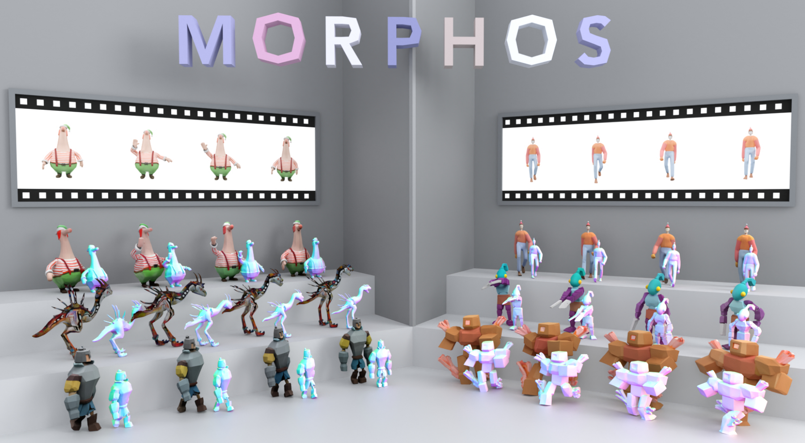

<p align="center">
  
</p>

# MORPHOS: Autoregressive 4D Generation with Temporal Structured Latents

<p align="center">
  <a href="https://mkxdxdxd.github.io/">Minkyung Kwon</a><sup>*</sup> ·
  <a href="https://wlsguur.github.io/">Jinhyeok Choi</a><sup>*</sup> ·
  <a href="https://jaden-shin-1214.github.io/">Youngjin Shin</a> ·
  Jaeyeong Kim ·
  <a href="https://icetea-cv.github.io/">JongMin Lee</a> ·
  Seungryong Kim<sup>&dagger;</sup>
</p>

<p align="center">
  KAIST AI<br>
  <sup>*</sup> Equal contribution &nbsp;·&nbsp; <sup>&dagger;</sup> Corresponding author
</p>

<p align="center">
  <a href="https://cvlab-kaist.github.io/MORPHOS/"></a>
  <a href="#"></a>
  <a href="https://huggingface.co/datasets/wlsgur1018/MORPHOS"></a>
  <a href="https://huggingface.co/datasets/wlsgur1018/T-SLat-10K"></a>
</p>

---

## Abstract

We present **MORPHOS**, an autoregressive 4D generative framework that produces dynamic 3D assets from video across **diverse representations — meshes, 3D Gaussians, and Radiance Fields**. We introduce **Temporal Structured Latents (T-SLat)**, a unified 4D representation that jointly encodes geometry and appearance over time. With causal attention, MORPHOS conditions each frame on its preceding history, and a **temporal-structural augmentation** strategy mitigates error accumulation for robust long-horizon generation.

## Release Plan

- [x] Inference code
- [x] Evaluation code
- [x] Training code
- [x] T-SLat training dataset
- [x] Pretrained model weights


## Overview

- [Installation](#installation)
- [Pretrained Models](#pretrained-models)
- [Inference](#inference)
- [Dataset](#dataset)
- [Training](#training)
- [Evaluation](#evaluation)

## Installation

1. Clone the repo

    ```
    git clone https://github.com/cvlab-kaist/MORPHOS.git
    cd MORPHOS
    ```

2. Install dependencies
    
    **Before setup, there are somthing to note:**

    - All experiments in the paper were trained and evaluated on **NVIDIA B200**, with pytorch 2.11.0 and CUDA 12.8.
    - We use bf16 autocast for DINOv2 encoder during training and inference. It only
    casts features back to fp32 before the trailing layer-norm. as the standard fp32 attention path that TRELLIS originally used
    does not dispatch on Blackwell, and only the bf16 flash-attn-2 kernel runs.
    - You can run our model on either Blackwell GPUs or original TRELLIS environment.

    A. To follow installation on B200 / Blackwell (CUDA 12.8):
    ```bash
    bash setup_b200.sh --new-env --basic --train --xformers --flash-attn \
                      --diffoctreerast --spconv --mipgaussian --kaolin --nvdiffrast --cumm
    ```

    B. Or you can follow the original TRELLIS installation (CUDA 12.4):

    ```bash
    . ./setup.sh --new-env --basic --train --xformers --flash-attn \
                --diffoctreerast --spconv --mipgaussian --kaolin --nvdiffrast
    ```
    This will create same environment with original TRELLIS. See the [TRELLIS installation](https://github.com/microsoft/TRELLIS#-installation) for more details.

3. Additional dependencies

    Install additional dependencies:
    ```bash
    conda activate morphos
    pip install ipyevents ipycanvas usd-core open_clip_torch dreamsim wandb
    ```

4. Modified FlexiCubes
    
    For mesh decoder, we use [modified FlexiCubes](https://github.com/MaxtirError/FlexiCubes).
    
    Clone the repo at `./trellis/representations/mesh/flexicubes`:

    ```
    git clone https://github.com/MaxtirError/FlexiCubes.git \
        trellis/representations/mesh/flexicubes
    ```

5. PyTorch3D (optional)

    For evaluation, install `pytorch3d` from the source:
    ```
    git clone https://github.com/facebookresearch/pytorch3d.git
    cd pytorch3d && pip install -e . --no-build-isolation
    ```

## Pretrained Models

### Flow DiT models

We provide pretrained MORPHOS weights on Hugging Face:
[Pretrained model](https://huggingface.co/datasets/wlsgur1018/MORPHOS)

| Model | Pretrained weight | Config |
|---|---|---|
| Temporal SS flow DiT  | `temporal_ss_flow_dit_w3_diffforcing.pt`   | `config/temporal_ss_flow_dit_w3_diffforcing.json` |
| T-SLat flow DiT | `temporal_slat_flow_dit_w3_diffforcing.pt` | `config/temporal_slat_flow_dit_w3_diffforcing.json` |

1. Download:

    ```bash
    huggingface-cli download wlsgur1018/MORPHOS \
        --local-dir <PATH_TO_MORPHOS_CHECKPOINTS>
    ```

2. Then open `config/inference_video_to_4d.json` and replace the two `<PATH_TO_*_PT>` with the paths to the downloaded checkpoints:

    ```json
    "ckpts": {
        "ss_config":    "./config/temporal_ss_flow_dit_w3_diffforcing.json",
        "ss_weights":   "<PATH_TO_MORPHOS_CHECKPOINTS>/temporal_ss_flow_dit_w3_diffforcing.pt",
        "slat_config":  "./config/temporal_slat_flow_dit_w3_diffforcing.json",
        "slat_weights": "<PATH_TO_MORPHOS_CHECKPOINTS>/temporal_slat_flow_dit_w3_diffforcing.pt"
    }
    ```

### Encoder & Decoders
We use original encoder decoders from [TRELLIS](https://github.com/microsoft/TRELLIS).

## Inference

Given an input video, MORPHOS generate 4D assets by two autoregressive diffusion process:

**1. Temporal Sparse Structure Generation.** A dense `(T, 8, 16³)` latent which can be decoded to a voxel grid.

**2. Temporal Structured Latent (T-SLat) Generation.** A sparse tensor where each visual feature vector is attached on sparse structure voxel; the T-SLat representation can be decoded to dynamic **Gaussians**, **meshes**, or **Radiance Fields**.

Run inference on provided RGBA videos in `examples/`:

```bash
./run_inference_video_to_4d.sh examples <OUT_DIR>
```

This produce rendered 3D Gaussians, Meshes, and T-SLat latents:
```
<OUT_DIR>/appearance/{scene}/{0|90|180|270}/frame_NNNN.png
<OUT_DIR>/geometry/{scene}/frame_NNNN.glb
<OUT_DIR>/slat/{scene}/frame_NNNN.npz
```

To modify inference config, see `config/inference_video_to_4d.json`.

## Dataset

### Data layout for training

```
<DATA_ROOT>/{ss_latents, slat_latents, renders_cond, encode_done}   # train
<DATA_ROOT>/val/{ss_latents, slat_latents, renders_cond}            # validation
```

We provide processed T-SLat dataset with 10K assets on Hugging Face: [Dataset](https://huggingface.co/datasets/wlsgur1018/T-SLat-10K)

Download:

```
# Download all split tar files
huggingface-cli download wlsguur/T-SLat-10K --repo-type dataset --local-dir ./T-SLat-10K --include "*.tar.*"

# Combine and extract
cat ./T-SLat-10K/t-slat-10k.tar.* | tar -xvf - -C ./
```

For preparing your own training dataset, see [`dataset_toolkits/DATASET.md`](dataset_toolkits/DATASET.md).


## Training

### Configs

| Model | Script | Config |
|---|---|---|
| Temporal SS     | `run_train_temporal_ss_flow_dit.sh`   |`DiffusionForcingSSImageConditionedTrainer` |
| T-SLat  | `run_train_temporal_slat_flow_dit.sh` |`DiffusionForcingSLatImageConditionedTrainer` |


Shared config args:

| Arg | Default | Meaning |
|---|---|---|
| `window_size` | 3 | Frames per training chunk. |
| `independent_t` | `true` | Diffusion Forcing training. Set `false` to share a same noise level across the whole window. |
| `t_schedule.name` | `"uniform"` | Noise-level distribution. `"logitNormal"` is also supported. |
| `snapshot_modes` | `["ar_kvcache"]` | Inference mode. `ar_kvcache` use autoregressive rollout with KV cache |
| `trainable_scope` | `"self_attn"` | Unfreezes `self_attn` + `adaLN_modulation`. Other scopes: `"transformer"` (whole block), `"all"` (whole base model), `"none"` (frozen). |


### Run training

1. Run training of **Temporal SS** flow model

    ```bash
    DATA_DIR=<DATA_ROOT> ./run_train_temporal_ss_flow_dit.sh
    ```

    You can resume training from checkpoints:
    ```bash
    DATA_DIR=<DATA_ROOT> LOAD_DIR=<CKPT_DIR> CKPT=<STEP> \
      ./run_train_temporal_ss_flow_dit.sh
    ```

2. Run training of **T-SLat** flow model


    T-SLat-specific configs:

    | Arg | Default | Meaning |
    |---|---|---|
    | `coord_drop_prob` | 0.05 | Per-token sparse-coord dropout rate. Models the inference scenario where some frames have SS prediction error. |
    | `coord_drop_num` | 2 | How many of the W window slots receive coord drop. `null` (or `>= W`) ⇒ drop on every slot. |

    For training, run:
    ```bash
    DATA_DIR=<DATA_ROOT> ./run_train_temporal_slat_flow_dit.sh
    ```

    You can resume training from checkpoints:
    ```bash
    DATA_DIR=<DATA_ROOT> LOAD_DIR=<CKPT_DIR> CKPT=<STEP> \
      ./run_train_temporal_slat_flow_dit.sh
    ```

### Validation

- Both stages: `val_mse_<mode>` — latent MSE per snapshot mode.
- Appearance metric for SLat: `val_lpips_<mode>`, `val_clip_<mode>`, `val_dreamsim_<mode>` — means over rendered 4-view tiles.


## Evaluation

Evaluate an inference output on your own benchmark.

1. Describe your benchmark in `config/evaluation.json`:

    ```json
    {
        "scenes_glob": "/path/to/gt/*/",
        "az_order":    ["0", "90", "180", "270"],
        "gt_4view":    "/path/to/gt/{scene}/{az}/frame_{frame:04d}.png",
        "gt_pcd":      "/path/to/gt/{scene}/pcd/frame_{frame:04d}.npy",
        "gt_face_glb": "/path/to/gt/{scene}.glb"
    }
    ```

    Fileds description:
    - `scenes_glob`: root of scene folders.
    - `gt_4view`: ground-truth 4-view video.
    - `gt_pcd`: ground-truth mesh vertices. It can be either per-frame `.npy` file, or a single `.npy` file without "frame" in the file name.
    - `gt_face_glb`: ground-truth mesh with faces (topology), aligned with `gt_pcd`. Required for Point-to-Surface (P2S).

2. Run (`PRED_PATH` is your inference `<OUT_DIR>`):

    ```bash
    PRED_PATH=<OUT_DIR> ./evaluate_samples.sh config/evaluation.json
    ```

Metrics:

- **Geometry** (`trellis/evaluation/metric_geometry.py`) — Chamfer Distance (CD),
  F-score, and Point-to-Surface (P2S).

- **Appearance** (`trellis/evaluation/metric_appearance.py`) — LPIPS, CLIP,
  DreamSim, and FVD.

## Acknowledgments

We thank the authors and teams of the following open-source projects:
- [TRELLIS](https://github.com/microsoft/TRELLIS)
- [Motion3-to-4](https://github.com/Inception3D/Motion324)
- [DFoT](https://github.com/kwsong0113/diffusion-forcing-transformer)

## Citation

If you find our work useful, please consider citing:

```bibtex
@article{kwon2026morphos,
  title   = {MORPHOS: Autoregressive 4D Generation with Temporal Structured Latents},
  author  = {Kwon, Minkyung and Choi, Jinhyeok and Shin, Youngjin and
             Kim, Jaeyeong and Lee, JongMin and Kim, Seungryong},
  journal = {arXiv preprint},
  year    = {2026}
}
```

## License

- This project is released under the [MIT License](LICENSE), inheriting from [TRELLIS](https://github.com/microsoft/TRELLIS).
- Submodule licenses ([diffoctreerast](https://github.com/JeffreyXiang/diffoctreerast), [modified FlexiCubes](https://github.com/MaxtirError/FlexiCubes)) apply where they are used.
